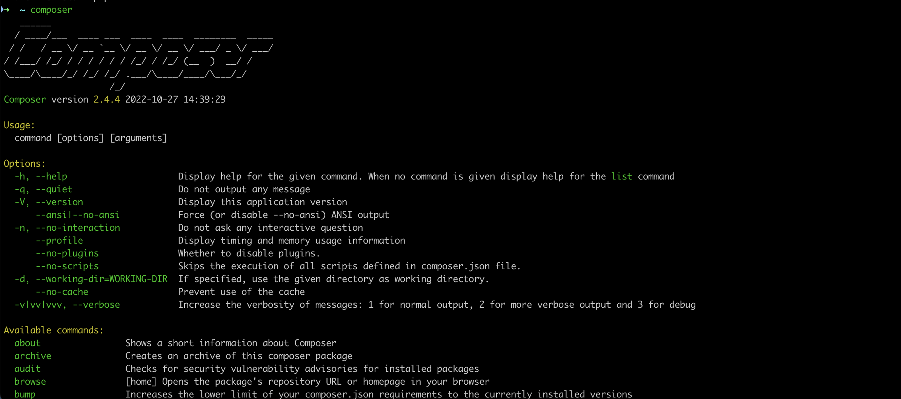

# Intro to Unit Testing in PHP

## Setup

1. Brew install PHP 
    - https://brew.sh/
    - `PHP -v`
2. Download Composer Locally 
    - `php -r "copy('https://getcomposer.org/installer', 'composer-setup.php');"`

    - `php -r "if (hash_file('sha384', 'composer-setup.php') === '55ce33d7678c5a611085589f1f3ddf8b3c52d662cd01d4ba75c0ee0459970c2200a51f492d557530c71c15d8dba01eae') { echo 'Installer verified'; } else { echo 'Installer corrupt'; unlink('composer-setup.php'); } echo PHP_EOL;"`

    - `php composer-setup.php`

    - `php -r "unlink('composer-setup.php');"`

    - `composer -V` (must be capitalized in this case)

    - [Composer download guide](https://getcomposer.org/download/)

3. Move the file so Composer is global
    - `mv composer.phar /usr/local/bin/composer`
    - [Composer global guide](https://getcomposer.org/doc/00-intro.md#globally)

3. Run composer via command line
    - Simply execute this command: `composer`
    - If you see something similar to the image below, celebrate 💃 
    - Else, debug



4. Add PHPUnit to a local project
    - `cd` into your project directory 

    - run the following command to install PHPUnit via composer `composer require --dev phpunit/phpunit ^9`

    - Then run `./vendor/bin/phpunit --version`

    - Run the following command so we can run our tests by simply typing phpunit

        `alias phpunit="./vendor/phpunit/phpunit/phpunit"`
    - to have the alias persist add it to your `.zshrc` or equivalent ([configure zsh](https://linuxhint.com/configure-use-aliases-zsh/))
    - composer.json and composer.lock files have now been created

    - Open your newly created composer.json file and you ought to see something similar to the following
    ```json 
    {

        "require-dev": {
            "phpunit/phpunit": "^9"
        }
    }
    ```
    - [PhpUnit getting started](https://phpunit.de/getting-started/phpunit-9.html)


## Write your first test


1. `mkdir tests` + `touch tests/ExampleTest.php` + cd `tests/ExampleTest.php`
2. Use a PHP class to extend the class of test case. One example of the syntax is: 
```php
<?php

class ExampleTest extends \PHPUnit\Framework\TestCase
{

}
    
?>
```
    However you can also use the \PHPUnit\Framework\TestCase in that namespace and dry up your code like so: 

```php
<?php

use \PHPUnit\Framework\TestCase;

class ExampleTest extends TestCase
{

}

?>
```
3. Fail your first test by running this from your terminal `phpunit tests/ExampleTest.php`
```
    1) Warning
    No tests found in class "ExampleTest".
```
4. Update the test to include an empty function
```php
<?php

use \PHPUnit\Framework\TestCase;

class ExampleTest extends TestCase
{
    public function testingTwoPlusTwoResultsInFour()
    {
        
    }

}

?>
```
    Run `phpunit tests/ExampleTest.php` again and you'll get the following error. 

```
    1) ExampleTest::testingTwoPlusTwoResultsInFour
    This test did not perform any assertions
```
5. Write your first assertion and pass your first test
    To do this we call the assertEquals method on the current object
    We've inherited the assertEquals method from the parent class of TestCase 
```php
<?php

use \PHPUnit\Framework\TestCase;

class ExampleTest extends TestCase
{
    public function testingTwoPlusTwoResultsInFour()
    {   
        $this->assertEquals(4, 2 + 2);

    }

}

?>
```
    In the above we have first passed the value we're expecting, 4, and then the equation we're testing 
    Run `phpunit tests/ExampleTest.php` again and we've passed our test
```
    OK (1 test, 1 assertion)
```
## Import a file to test with variable input

1. `touch functions.php` + `touch tests/FunctionTest.php`
2. In functions.php
```php
<?php
/**
 * @param integer $a is the first number
 * @param integer $b is the second number 
 * 
 * @return integer is the sum of the two numbers
 */
function add($a, $b) {
    return $a + $b;
};
```
3. In FunctionTest.php
```php
<?php

use \PHPUnit\Framework\TestCase;

    class FunctionTest extends TestCase
    {
        public function testAddReturnsTheCorrectSum()
        {
            require 'functions.php';
            $this->assertEquals(4, add(2, 2));
            $this->assertEquals(8, add(3, 5));

        }
    }

?>
```
4. Run `phpunit tests/FunctionTest.php` and you will get
```
    OK (1 test, 2 assertions)
```

4. Assert for Not Equals 
```php
use \PHPUnit\Framework\TestCase;

class FunctionTest extends TestCase
{
    public function testAddReturnsTheCorrectSum()
    {
        require 'functions.php';
        $this->assertEquals(4, add(2, 2));
        $this->assertEquals(8, add(3, 5));
    }

    public function testAddDoesNotReturnTheIncorrectSum()
    {
        $this->assertNotEquals(5, 2 + 2);
    }
}
?>
```

Many other assertions can be found in [php unit docs - assertions](https://phpunit.readthedocs.io/en/9.5/assertions.html)

## Tips
- Test methods should be public
- Make your tests named as verbosely/descriptively as you can, this serves as documentation 
- All tests should start with the name 'test' by default, otherwise the test wont run without further configuration 
- If you would prefer to use snake case for example, and not include the word test every time, you can use the following syntax 

```php
<?php
    use \PHPUnit\Framework\TestCase;

    class UserTest extends TestCase
    {
    /**
     * @test
    */
        public function user_has_first_name() 
        {
            $user = new User;

            $user->first_name="Yasmin";

            $this->assertEquals("Yasmin", $user->first_name);
        }
    }
?>
```
- The above example is testing the User class
- While the @test appears to be in a comment, PHP is reading it
- @test allows you to not use test in the function name of your PHPUnit test and still having it execute 